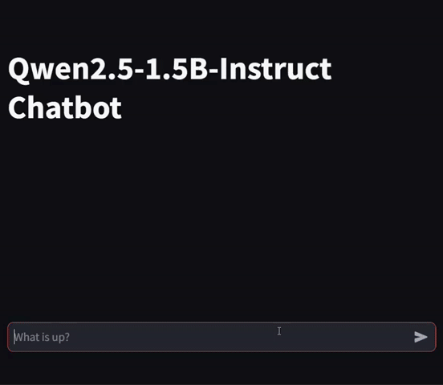

# Qwen2.5-1.5B-Instruct Chatbot

This is a Streamlit-based chatbot powered by Alibaba Cloud's Qwen2.5-1.5B-Instruct model. It allows users to interact with the model in a conversational manner using a simple web interface.

## Table of Contents

- [Features](#features)
- [Installation](#installation)
- [Usage](#usage)
- [How It Works](#how-it-works)
- [Model Performance](#model-performance)
- [Quantization Performance](#quantization-performance)
- [Customization](#customization)
- [License](#license)
- [Author](#author)

## Features

- **Uses Streamlit UI** for an easy-to-use chat interface.
- **Utilizes Hugging Face Transformers** to load and interact with the `Qwen/Qwen2.5-1.5B-Instruct` model.
- **GPU acceleration** with `torch.bfloat16` for efficient inference.
- **Maintains chat history** during the session.
- **Compiles the model** using `torch.compile()` to optimize performance.

## Installation

### Prerequisites

Ensure you have the following installed:

- Python 3.8+
- `pip` package manager
- A CUDA-enabled GPU (for better performance)

### Install Dependencies

Run the following command to install required Python packages:

```bash
pip install streamlit transformers torch
```

## Usage

### Demonstration

Below is a GIF demonstrating the chatbot in action:



### Run the chatbot

Execute the following command in your terminal:

```bash
streamlit run app.py
```

This will launch a local Streamlit web app where you can interact with the chatbot.

## How It Works

1. The model and tokenizer are loaded using Hugging Face's `AutoModelForCausalLM` and `AutoTokenizer`.
2. User messages are tokenized and passed to the model for text generation.
3. The model generates responses based on the chat history and temperature settings.
4. Responses are displayed in the Streamlit chat UI.

## Model Performance

The **Qwen2.5-1.5B-Instruct** model provides high-quality responses optimized for instruction-based chat. Key performance metrics include:

- **Inference Speed**: Optimized with `torch.compile()` for reduced latency.
- **Accuracy**: Fine-tuned for instruction-following and task-specific queries.
- **Computational Efficiency**: Runs efficiently on a CUDA-enabled GPU with `torch.bfloat16`.
- **Response Quality**: Generates context-aware and coherent replies, making it suitable for diverse conversational needs.

### Quantization Performance

| Quantization | Average | MMLU | C-Eval | IFEval |
| ------------ | ------- | ---- | ------ | ------ |
| BF16         | 48.4    | 52.4 | 63.8   | 29.0   |
| GPTQ-Int8    | 48.1    | 53.0 | 62.5   | 28.8   |
| GPTQ-Int4    | 45.0    | 50.7 | 57.4   | 27.0   |
| AWQ          | 46.5    | 51.6 | 58.1   | 29.9   |

## Customization

- **Modify System Prompt**: Adjust the system message in `messages` to change the chatbot's behavior.
- **Tune Hyperparameters**: Change `max_new_tokens`, `temperature`, or `repetition_penalty` in `model.generate()` to tweak response generation.


## License

This project is open-source and available under the MIT License.

## Author

Developed by [**AbdullahAlokayl**](https://github.com/AbdullahAlokayl)\*\* using Qwen2.5-1.5B-Instruct and Streamlit.\*\*

